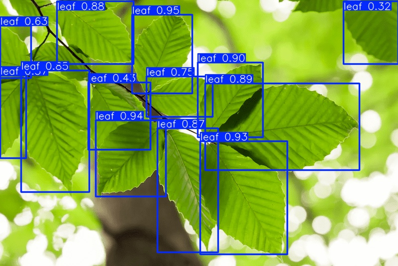

# leaf_detecetion

# Step 1 Environment Setup
Only dependency is 
```
python3 -m pip install ultralytics
```

# Step 2 Upload images
Put images to eval under `test/leaf/`


# Step 3 Run eval
```
python3 eval.py
```

```
image 1/9 /Users/jasonychen/Desktop/github/leaf_detection/test/leaf/TEST_001.jpg: 1024x1024 86 leafs, 408.5ms
image 2/9 /Users/jasonychen/Desktop/github/leaf_detection/test/leaf/TEST_002.jpg: 1024x1024 72 leafs, 336.5ms
image 3/9 /Users/jasonychen/Desktop/github/leaf_detection/test/leaf/TEST_003.jpg: 1024x1024 15 leafs, 332.8ms
image 4/9 /Users/jasonychen/Desktop/github/leaf_detection/test/leaf/TEST_004.jpg: 1024x1024 74 leafs, 338.4ms
image 5/9 /Users/jasonychen/Desktop/github/leaf_detection/test/leaf/TEST_005.jpg: 1024x1024 89 leafs, 374.4ms
image 6/9 /Users/jasonychen/Desktop/github/leaf_detection/test/leaf/TEST_006.jpg: 1024x1024 4 leafs, 338.3ms
image 7/9 /Users/jasonychen/Desktop/github/leaf_detection/test/leaf/TEST_007.jpg: 1024x1024 29 leafs, 335.2ms
image 8/9 /Users/jasonychen/Desktop/github/leaf_detection/test/leaf/leaf.png: 1024x1024 13 leafs, 345.9ms
image 9/9 /Users/jasonychen/Desktop/github/leaf_detection/test/leaf/tree_leaves.png: 1024x1024 13 leafs, 339.6ms
Speed: 4.7ms preprocess, 349.9ms inference, 0.9ms postprocess per image at shape (1, 3, 1024, 1024)
Results saved to runs/detect/predict3
```

# Step 4 View result images
View result images to eval under `runs/detect/predict/`


